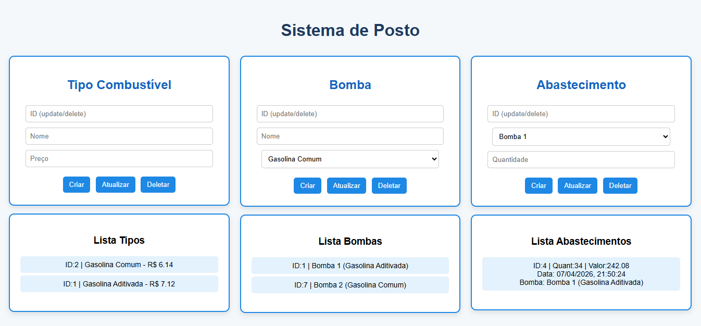
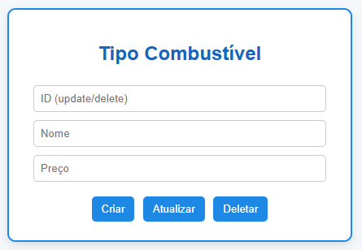
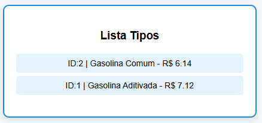

# ⛽ Sistema de Gestão para Postos de Gasolina

Uma API REST completa para gerenciamento de postos de gasolina, permitindo o controle de tipos de combustíveis, bombas e registros de abastecimento.

---

## 🛠 Tecnologias Utilizadas

* **Linguagem:** Java 25
* **Framework:** Spring Boot (Data JPA, Web)
* **Banco de Dados:** PostgreSQL
* **Gerenciador de Dependências:** Maven
* **Front-end:** HTML5, CSS3 e JavaScript (integrado via API)
* **IDE IntelliJ:** Utilizada para o desenvolvimento e gerenciamento do projeto.

---

## 🚀 Funcionalidades (CRUD)

O sistema permite a gestão completa das seguintes entidades:

* **Tipo de Combustível:** Cadastro de categorias (Gasolina, Diesel, Etanol).
* **Bomba de Combustível:** Gerenciamento das bombas físicas do posto.
* **Abastecimento:** Registro de operações de abastecimento vinculando bombas e tipos de combustível.

---

## 📋 Pré-requisitos

Antes de começar, você vai precisar ter instalado em sua máquina:
* [JDK 25](https://www.oracle.com/java/technologies/downloads/)
* [Maven](https://maven.apache.org/download.cgi)
* [PostgreSQL](https://www.postgresql.org/download/)

---

## 🛣️ Endpoints Principais (API)

Abaixo estão os principais endpoints da aplicação. Para testar manualmente (via Postman ou Insomnia), certifique-se de que o servidor está rodando em `http://localhost:8080`.

| Entidade | Método | Endpoint | Descrição |
| :--- | :--- | :--- | :--- |
| **Tipo de Combustível** | `GET` | `/tipos` | Lista todos os tipos de combustível |
| **Tipo de Combustível** | `POST` | `/tipos` | Cadastra um novo tipo |
| **Tipo de Combustível** | `PUT` | `/tipos/{id}` | Atualiza um tipo existente pelo ID |
| **Tipo de Combustível** | `DELETE` | `/tipos/{id}` | Remove um tipo pelo ID |
| **Bomba** | `GET` | `/bombas` | Lista todas as bombas |
| **Bomba** | `POST` | `/bombas` | Cadastra uma nova bomba física |
| **Bomba** | `DELETE` | `/bombas/{id}` | Remove uma bomba pelo ID |
| **Abastecimento** | `POST` | `/abastecimentos/bomba/{id}` | Registra abastecimento vinculado ao ID da bomba |
| **Abastecimento** | `GET` | `/abastecimentos` | Lista o histórico de abastecimentos |

### 📝 Exemplos de Payload
```
**Atualizar Tipo de Combustível (`PUT /tipos/1`):**
json
{
  "name": "Gasolina Comum",
  "precoComb": 5.45
}

**Cadastrar Tipo de Combustível (`POST /tipos`):**
{
  "name": "Gasolina Aditivada",
  "precoComb": 5.89
}

**Registrar um novo Abastecimento(POST /abastecimentos/bomba/1):**
{
  "quant": 20.0
}
```
---

## 📸 Demonstração do Sistema

Aqui estão algumas capturas de tela da interface e do funcionamento da aplicação:

### Interface Principal


### Modelo de Componentes (DivModel)


OBS: 
- Tipo de Combustível deve ser o primeiro a ser desenvolvido, afinal, Bombas de Combustível dependem de um Tipo, além de que para efetuar um Abastecimento, é necessário uma Bomba.
- O campo de ID é exclusivo para 'Atualizar' (Preencher ID, Nome e Preço) e 'Deletar' (Preencher apenas o ID).
- Na criação dos objetos NÃO é necessário preencher o ID, apenas os outros campos de informações.
- Se um Tipo de Combustível está ligado à uma Bomba de Combustível, ou, uma Bomba está ligada à um Abastecimento, é impossível DELETAR esses objetos.

### Listagem de Dados


- Listagem automática dos objetos existentes no Banco de Dados.

---

## 🔧 Instalação e Configuração

1. **Clone o repositório:**

   ```bash
   git clone [https://github.com/bimmelleo/testeTecnico.git](https://github.com/bimmelleo/testeTecnico.git)
   cd testeTecnico

   **IMPORTANTE:**
   Caminho para os arquivos '.java': Teste/src/main/java/testeTecnico
   Caminho para o frontEnd: Teste/src/main/resources/frontend
   Caminho para o 'application.properties': Teste/src/main/resources

2. **Certifique-se de possuir um Banco de Dados criado em PostgreSQL**

     Muito importante possuir um Banco de Dados que exista para conectar ele em "application.properties":
   
"spring.application.name=Teste"
"spring.datasource.url=jdbc:postgresql://localhost:5432/SEU_BANCO"
"spring.datasource.username=SEU_USER"
"spring.datasource.password=SUA_SENHA"

3. **Sempre executar a classe "TesteApplication.java"**

     O servidor será iniciado por padrão na porta 8080. Somente após o log "Started TesteApplication" aparecer no console, abra o 'index.html'.


/bimmelleo
